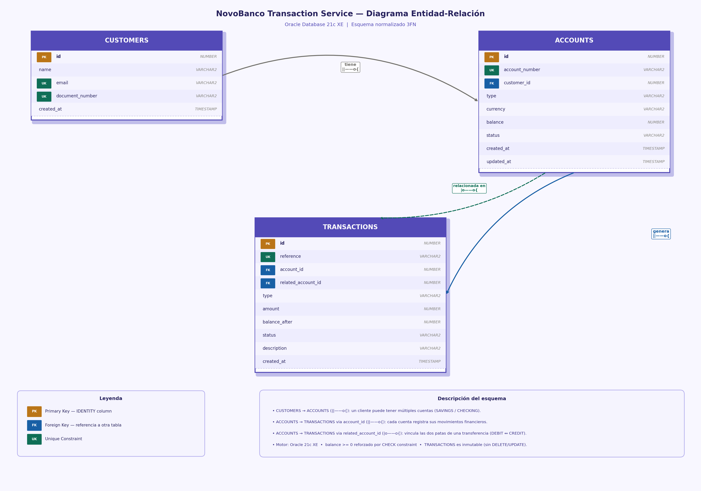

# NovoBanco — Microservicio de Gestión de Cuentas y Transacciones

## Descripción del problema

El reto consiste en diseñar e implementar un microservicio bancario que permita gestionar clientes, cuentas y transacciones financieras con garantías de integridad y consistencia de datos.

### Funcionalidades requeridas

| Recurso | Operaciones |
|---|---|
| **Clientes** | Crear, consultar |
| **Cuentas** | Crear, consultar por número / cliente, bloquear, cerrar |
| **Depósitos** | Realizar depósito sobre una cuenta activa |
| **Retiros** | Realizar retiro con validación de saldo |
| **Transferencias** | Transferencia atómica entre dos cuentas activas |
| **Historial** | Consultar transacciones paginadas por cuenta |

### Restricciones de negocio

- Solo las cuentas en estado `ACTIVE` pueden operar (depósito, retiro, transferencia).
- No se permiten montos negativos ni cero.
- No puede retirarse más del saldo disponible.
- Toda transacción lleva una referencia única de idempotencia.
- Cada intento de operación queda registrado, ya sea exitoso (`SUCCESS`) o fallido (`FAILED`).

---

## Tecnologías utilizadas

| Categoría | Tecnología | Versión |
|---|---|---|
| Lenguaje | Java | 21 |
| Framework principal | Spring Boot | 4.0.6 |
| Web | Spring WebMVC | 7.0.7 |
| Persistencia | Spring Data JPA / Hibernate | 7.0.7 / 7.2.x |
| Base de datos | Oracle Database XE | 21c |
| Driver JDBC | ojdbc11 | 23.4.0.24.05 |
| Mapeo DTO↔Entidad | MapStruct | 1.6.3 |
| Reducción de boilerplate | Lombok | (BOM Spring Boot) |
| Pool de conexiones | HikariCP | (BOM Spring Boot) |
| Pruebas unitarias | JUnit 5 + Mockito + AssertJ | (BOM Spring Boot) |
| Contenedores | Docker + Docker Compose | — |

---

## Restricciones y Escenarios de Negocio

Esta sección documenta cómo se resolvió cada restricción planteada, la capa elegida y la justificación técnica.

---

### Saldo negativo

**¿En qué capa se previene?**

En la **entidad de dominio** `Account`, dentro del método `withdraw`:

```java
// Account.java
private void validateSufficientFunds(Money amount) {
    if (!balance.isGreaterThanOrEqualTo(amount)) {
        throw new InsufficientFundsException(accountNumber, amount, balance);
    }
}
```

**Justificación:** La regla de negocio "no se puede retirar más de lo que hay" es un invariante del dominio, no una regla de aplicación ni de infraestructura. Colocarla en la entidad garantiza que ningún caso de uso pueda violarla por error u omisión, independientemente de si el acceso viene de la API REST, un job batch u otro adaptador futuro. El servicio no necesita conocer esta regla; simplemente llama a `account.withdraw(amount)` y la entidad se defiende sola.

Adicionalmente, el tipo `Money` usa `BigDecimal` con escala fija, lo que elimina errores de redondeo de punto flotante antes de que la comparación ocurra.

---

### Cuenta inactiva

**¿Cómo se rechaza y qué error se devuelve?**

También en la entidad de dominio, dentro de `validateIsActive()`:

```java
// Account.java
private void validateIsActive() {
    if (this.status != AccountStatus.ACTIVE) {
        throw new InactiveAccountException(accountNumber, status);
    }
}
```

El `GlobalExceptionHandler` mapea esta excepción específica a HTTP 422 con un código de error propio:

```json
{
  "status": 422,
  "code": "cuenta-inactiva",
  "detail": "La cuenta 0000000001 no puede operar: estado actual es BLOCKED. Solo las cuentas ACTIVE pueden realizar transacciones."
}
```

**Justificación:** Usar una excepción de dominio específica (`InactiveAccountException`) en lugar de un error genérico permite que el cliente diferencie la causa exacta del rechazo. El mensaje incluye el número de cuenta y el estado actual, facilitando el diagnóstico sin necesidad de consultas adicionales. El handler mapea cada excepción de dominio a su propio código HTTP y `code` de negocio, nunca al genérico 500.

---

### Transferencia parcial

**Problema:** Si el débito sobre la cuenta origen se aplica pero el crédito sobre la cuenta destino falla, ¿qué ocurre?

**Solución: atomicidad con `@Transactional`**

Toda la operación de transferencia ocurre dentro de una única transacción de base de datos:

```java
// TransferService.java
@Override
@Transactional
public TransferResult transfer(TransferCommand command) {
    // ...
    source.withdraw(amount);   // modifica saldo origen en memoria
    target.deposit(amount);    // modifica saldo destino en memoria
                               // si lanza excepción aquí → rollback completo
    accountOutputPort.save(source);
    accountOutputPort.save(target);
    // ...
}
```

Si `target.deposit(amount)` lanza `InactiveAccountException` (cuenta destino bloqueada), Spring marca la transacción para rollback antes de que ningún `save` llegue a la base de datos. Oracle deshace cualquier cambio parcial. **El estado final siempre es consistente: o se aplican ambas patas o ninguna.**

El registro del intento fallido se hace en una transacción separada (`Propagation.REQUIRES_NEW`) para que ese registro persista aunque la transacción principal revierte — ver sección siguiente.

---

### Concurrencia básica

**Problema:** Dos retiros simultáneos de 800 sobre una cuenta con saldo 1000 no pueden dejar el saldo en -600.

**Solución: SELECT FOR UPDATE**

Antes de modificar el saldo, el servicio obtiene un lock exclusivo sobre la fila:

```java
// WithdrawService.java
Account account = accountOutputPort.findByAccountNumberForUpdate(command.accountNumber())
        .orElseThrow(...);
```

Esto emite en Oracle:

```sql
SELECT * FROM accounts WHERE account_number = ? FOR UPDATE
```

El segundo retiro concurrente queda bloqueado en este punto hasta que el primero termine su transacción (commit o rollback). Una vez liberado el lock, lee el saldo actualizado y, si no hay fondos suficientes, lanza `InsufficientFundsException`.

**Resultado:** Es imposible que dos retiros simultáneos lean el mismo saldo y ambos pasen la validación de fondos. El mecanismo es correcto para un único nodo de base de datos sin requerir coordinación distribuida.

Las transferencias aplican el mismo mecanismo sobre ambas cuentas. Para evitar deadlocks cuando dos transferencias A→B y B→A ocurren en paralelo, los locks siempre se adquieren en **orden alfabético** por número de cuenta:

```java
List<String> ordered = List.of(source, target).stream().sorted().toList();
Account first  = lockAccount(ordered.get(0));  // lock A siempre primero
Account second = lockAccount(ordered.get(1));  // lock B siempre segundo
```

Esto elimina el ciclo de espera que causaría un deadlock.

---

### Idempotencia

**Problema:** El cliente envía un depósito y la red falla antes de recibir respuesta. Reintenta con el mismo payload. ¿Se aplica el depósito dos veces?

**Solución implementada:** idempotencia completa por campo `reference`.

Cada operación incluye una `reference` generada por el cliente (ej. `"DEP-20240503-001"`). Al recibir la petición, el servicio consulta si ya existe una transacción con esa referencia:

```java
// DepositService.java
Optional<Transaction> existing = transactionOutputPort.findByReference(command.reference());
if (existing.isPresent()) {
    if (existing.get().getStatus() == TransactionStatus.SUCCESS) return existing.get();
    throw new DuplicateTransactionException(command.reference());
}
```

| Situación | Comportamiento |
|---|---|
| Primera llamada | Procesa normalmente → `201 Created` |
| Retry tras éxito (misma `reference`) | Devuelve la transacción original → `200 OK`, sin reprocesar |
| Retry tras fallo de negocio | `409 Conflict` → el cliente debe usar una nueva `reference` |

**Para transferencias**, la pata de crédito usa `{reference}-CREDIT` como referencia determinista. En un retry exitoso, ambas patas se recuperan por referencia sin necesidad de consultas adicionales.

**Registro de intentos fallidos:** Cuando una operación falla por regla de negocio, se guarda un registro `FAILED` en base de datos usando `Propagation.REQUIRES_NEW`. Esto permite auditar todos los intentos (exitosos y fallidos) y que el historial de transacciones refleje la realidad operacional completa.

---

## Decisiones técnicas

### 1. Arquitectura Hexagonal (Ports & Adapters)

El proyecto sigue una arquitectura hexagonal estricta con tres capas bien definidas:

```
domain/          → Entidades, value objects, excepciones de negocio (sin dependencias externas)
application/     → Casos de uso (puertos de entrada y salida), servicios de aplicación
infrastructure/  → Adaptadores REST, JPA, configuración
```

Esto garantiza que el dominio y la lógica de negocio son completamente independientes del framework, la base de datos o el protocolo de transporte.

### 2. Entidades de dominio con reglas de negocio encapsuladas

Las reglas de negocio viven dentro de las entidades del dominio (`Account`, `Transaction`), no en los servicios. Por ejemplo:

```java
account.deposit(amount);   // lanza InactiveAccountException si la cuenta no está ACTIVE
account.withdraw(amount);  // lanza InsufficientFundsException si no hay saldo suficiente
account.block();           // lanza InactiveAccountException si la cuenta ya está CLOSED
```

### 3. Money como Value Object

El tipo `Money` encapsula los cálculos monetarios con `BigDecimal` y escala fija, evitando errores de punto flotante y asegurando precisión financiera.

### 4. Control de concurrencia con SELECT FOR UPDATE

Los depósitos, retiros y transferencias usan `findByAccountNumberForUpdate` (SELECT FOR UPDATE) para bloquear la fila en base de datos durante la operación. Esto previene condiciones de carrera cuando dos operaciones simultáneas afectan la misma cuenta.

### 5. Anti-deadlock en transferencias

Las transferencias bloquean siempre las cuentas en **orden alfabético** por número de cuenta. Si dos transferencias A→B y B→A ocurren en paralelo, ambas esperan el mismo lock primero, eliminando la posibilidad de deadlock circular.

### 6. Idempotencia por referencia

Cada operación recibe una `reference` de cliente. Si la misma referencia se recibe de nuevo:

- **Primera vez exitosa** → devuelve la transacción original (`200 OK`) sin reprocesar.
- **Primera vez fallida** → devuelve `409 Conflict` para que el cliente use una nueva referencia.

La pata de crédito en una transferencia usa `{reference}-CREDIT` como referencia determinista, permitiendo recuperar ambas patas en un retry.

### 7. Registro de transacciones fallidas con REQUIRES_NEW

Cuando una operación falla por regla de negocio (`InactiveAccountException`, `InsufficientFundsException`), el error queda registrado en la tabla `TRANSACTIONS` con `status = FAILED`. Esto se logra usando `Propagation.REQUIRES_NEW` en `FailedTransactionRecorder`: la transacción de registro se comitea de forma independiente aunque la transacción principal haga rollback.

### 8. DDL gestionado por Hibernate

Se usa `ddl-auto: update` para que Hibernate cree y actualice el esquema automáticamente al arrancar. Esto simplifica el despliegue en entornos de desarrollo y prueba sin necesidad de scripts de migración adicionales.

### 9. Pruebas unitarias puras

Todas las pruebas son unitarias con JUnit 5, Mockito y AssertJ, organizadas por capa:

- **Dominio**: `MoneyTest`, `AccountTest` — reglas de negocio puras
- **Servicios**: `AccountServiceTest`, `DepositServiceTest`, `WithdrawServiceTest`, `TransferServiceTest`, etc.
- **Adaptadores de persistencia**: mocks de repositorios JPA
- **Controllers REST**: `MockMvcBuilders.standaloneSetup` sin contexto Spring

### 10. Dockerfile multi-etapa

```
Etapa 1 (builder): maven:3.9-eclipse-temurin-21 → compila y empaqueta el JAR
Etapa 2 (runtime): eclipse-temurin:21-jre       → imagen final mínima (~200 MB vs ~600 MB)
```

---

## Diagrama Entidad-Relación



---

## Estructura del proyecto

```
src/main/java/com/novobanco/transaction/
├── domain/
│   ├── model/          Account, Customer, Transaction, Money, enums
│   └── exception/      AccountNotFoundException, InsufficientFundsException, ...
├── application/
│   ├── port/input/     Casos de uso (interfaces) + Commands
│   ├── port/output/    Puertos de salida (interfaces)
│   └── service/        Implementaciones de casos de uso
└── infrastructure/
    ├── adapter/input/
    │   ├── rest/        Controllers, DTOs request/response
    │   └── exception/   GlobalExceptionHandler, ErrorResponse
    └── adapter/output/
        └── persistence/ Adaptadores JPA, entidades JPA, mappers MapStruct
```

---

## Instrucciones de ejecución

### Opción A — Docker Compose (recomendado)

Levanta Oracle XE y el microservicio en un solo comando:

```bash
docker compose up --build -d
```

> La primera ejecución descarga la imagen de Oracle (~1.5 GB) e inicializa la base de datos.  
> El microservicio espera a que Oracle esté listo (`service_healthy`) antes de arrancar.

Verificar que todo esté corriendo:

```bash
docker compose ps
docker compose logs app -f
```

Detener y limpiar (incluyendo volumen de datos):

```bash
docker compose down -v
```

---

### Opción B — Ejecución local (Oracle externo)

**Requisitos previos:** Java 21, Maven 3.9+, Oracle XE accesible.

```bash
# Compilar y ejecutar
./mvnw spring-boot:run \
  -Dspring-boot.run.jvmArguments="\
    -DDB_URL=jdbc:oracle:thin:@localhost:1521/XEPDB1 \
    -DDB_USERNAME=novobanco \
    -DDB_PASSWORD=Novobanco123#"
```

O con variables de entorno:

```bash
export DB_URL=jdbc:oracle:thin:@localhost:1521/XEPDB1
export DB_USERNAME=novobanco
export DB_PASSWORD=Novobanco123#
./mvnw spring-boot:run
```

La aplicación arranca en `http://localhost:8080`.

---

### Ejecutar pruebas unitarias

```bash
./mvnw test
```

Resultado esperado: **99 tests, 0 failures**.

---

### Conexión a la base de datos (DataGrip / DBeaver)

| Campo | Valor |
|---|---|
| Host | `localhost` |
| Puerto | `1521` |
| Service Name | `XEPDB1` |
| Usuario | `novobanco` |
| Contraseña | `Novobanco123#` |

---

## API Reference

Base URL: `http://localhost:8080/api/v1`

### Clientes

| Método | Endpoint | Descripción | HTTP |
|---|---|---|---|
| `POST` | `/customers` | Crear cliente | 201 |
| `GET` | `/customers/{id}` | Obtener cliente por ID | 200 |

### Cuentas

| Método | Endpoint | Descripción | HTTP |
|---|---|---|---|
| `POST` | `/accounts` | Crear cuenta | 201 |
| `GET` | `/accounts/{accountNumber}` | Obtener cuenta por número | 200 |
| `GET` | `/accounts/customer/{customerId}` | Cuentas de un cliente | 200 |
| `PATCH` | `/accounts/{accountNumber}/status` | Bloquear / cerrar cuenta | 200 |

### Transacciones

| Método | Endpoint | Descripción | HTTP |
|---|---|---|---|
| `POST` | `/accounts/{accountNumber}/deposits` | Depósito | 201 |
| `POST` | `/accounts/{accountNumber}/withdrawals` | Retiro | 201 |
| `POST` | `/accounts/transfers` | Transferencia | 201 |
| `GET` | `/accounts/{accountNumber}/transactions` | Historial paginado | 200 |

### Respuestas de error

Todos los errores devuelven el mismo formato:

```json
{
  "status": 422,
  "code": "fondos-insuficientes",
  "detail": "La cuenta 0000000001 no tiene fondos suficientes..."
}
```

| HTTP | Código | Causa |
|---|---|---|
| 400 | `validacion-fallida` | Campos requeridos vacíos o inválidos |
| 400 | `monto-invalido` | Monto ≤ 0 |
| 404 | `cuenta-no-encontrada` | Número de cuenta inexistente |
| 404 | `cliente-no-encontrado` | ID de cliente inexistente |
| 409 | `transaccion-duplicada` | Referencia ya usada en transacción fallida |
| 409 | `cliente-duplicado` | Email o documento ya registrado |
| 422 | `fondos-insuficientes` | Saldo insuficiente para retiro / transferencia |
| 422 | `cuenta-inactiva` | Operación sobre cuenta BLOCKED o CLOSED |
| 500 | `error-interno` | Error inesperado del servidor |

---

## ADR — Architecture Decision Records

Registro de las decisiones arquitectónicas más relevantes tomadas durante el desarrollo.

---

### ADR-001 — Arquitectura Hexagonal (Ports & Adapters)

**Contexto**

Se necesita un microservicio bancario que pueda crecer, ser testeado de forma aislada y cambiar su mecanismo de persistencia o protocolo de comunicación sin reescribir lógica de negocio. En un contexto bancario, la estabilidad del dominio es prioritaria sobre la comodidad de un enfoque más simple.

**Opciones consideradas**

| Opción | Descripción | Problema |
|---|---|---|
| MVC en capas (Controller → Service → Repository) | Enfoque estándar Spring | El dominio queda acoplado al framework y a JPA. Difícil de testear sin base de datos. |
| Arquitectura Hexagonal | Dominio puro en el centro, adaptadores en la periferia | Mayor cantidad de clases e interfaces; complejidad inicial más alta. |
| CQRS completo | Separación total de comandos y consultas con buses | Sobre-ingeniería para el alcance del problema. |

**Decisión**

Se adoptó **Arquitectura Hexagonal** con separación estricta en tres capas:
- `domain` — entidades, value objects y excepciones sin ninguna dependencia de Spring o JPA.
- `application` — puertos (interfaces) y servicios de aplicación que orquestan el dominio.
- `infrastructure` — adaptadores REST y JPA que implementan los puertos.

**Consecuencias**

- ✅ El dominio es testeable con JUnit puro, sin necesidad de levantar contexto Spring ni base de datos.
- ✅ Cambiar Oracle por PostgreSQL solo requiere modificar los adaptadores JPA, no el dominio.
- ✅ Los casos de uso están explícitamente declarados como interfaces (`DepositUseCase`, `TransferUseCase`, etc.), facilitando la comprensión del sistema.
- ⚠️ Mayor número de clases e interfaces respecto a un CRUD tradicional.

---

### ADR-002 — Control de concurrencia con SELECT FOR UPDATE y orden de locks alfabético

**Contexto**

Dos retiros simultáneos sobre la misma cuenta con saldo insuficiente para ambos no deben dejar el saldo en negativo. Las transferencias bidireccionales simultáneas (A→B y B→A) no deben provocar un deadlock en base de datos. Se requiere una solución correcta sin complejidad distribuida.

**Opciones consideradas**

| Opción | Descripción | Problema |
|---|---|---|
| Validación en memoria sin lock | Leer saldo, validar, escribir | Condición de carrera: dos lecturas simultáneas ven el mismo saldo y ambas pasan la validación. |
| Bloqueo optimista (`@Version`) | Versión en la entidad, reintento si hay conflicto | Requiere lógica de reintento en el servicio; complejidad adicional para el cliente. |
| `SELECT FOR UPDATE` (bloqueo pesimista) | Lock exclusivo en la fila hasta el commit | Serializa las escrituras sobre la misma cuenta sin lógica de reintento. |
| Lock distribuido (Redis, Zookeeper) | Lock fuera de la base de datos | Añade una dependencia de infraestructura externa innecesaria para un único nodo. |

**Decisión**

Se usa **`SELECT FOR UPDATE`** a través de `@Lock(LockModeType.PESSIMISTIC_WRITE)` en el repositorio JPA. El segundo hilo concurrente queda bloqueado hasta que el primero libera el lock al hacer commit. Una vez liberado, lee el saldo ya actualizado y evalúa correctamente la disponibilidad de fondos.

Para evitar deadlocks en transferencias, los locks se adquieren siempre en **orden alfabético** por número de cuenta:

```java
List<String> ordered = List.of(source, target).stream().sorted().toList();
Account first  = lockAccount(ordered.get(0));
Account second = lockAccount(ordered.get(1));
```

Si A→B y B→A ocurren en paralelo, ambas intentan bloquear A primero. Una espera a la otra. No hay ciclo → no hay deadlock.

**Consecuencias**

- ✅ Corrección garantizada: imposible que dos operaciones simultáneas corrompan el saldo.
- ✅ Sin dependencias de infraestructura adicionales.
- ✅ El orden de locks es determinista y verificable en pruebas unitarias.
- ⚠️ Mayor contención bajo alta concurrencia sobre la misma cuenta. Aceptable para el alcance del ejercicio; en producción se complementaría con particionamiento por cuenta.

---

### ADR-003 — Registro de transacciones fallidas con Propagation.REQUIRES_NEW

**Contexto**

Toda operación bancaria debe quedar registrada, ya sea exitosa o fallida. Cuando un depósito se intenta sobre una cuenta bloqueada, la transacción principal hace rollback (nada cambia en el saldo), pero el intento debe persistir en la tabla `TRANSACTIONS` con `status = FAILED` para fines de auditoría.

**Opciones consideradas**

| Opción | Descripción | Problema |
|---|---|---|
| Guardar el FAILED dentro de la misma transacción | `transactionOutputPort.save(failed)` antes del rollback | El rollback de Spring revierte también el INSERT del registro FAILED. Nada persiste. |
| Tabla de auditoría separada fuera de transacción | Escribir a un log o tabla sin transacción | Viola el modelo relacional; sin garantías de consistencia. |
| Evento de aplicación post-rollback | `@TransactionalEventListener(phase = AFTER_ROLLBACK)` | Requiere publicar y manejar eventos; mayor complejidad y acoplamiento. |
| Transacción independiente (`REQUIRES_NEW`) | Bean separado con su propia transacción | El commit del registro FAILED es independiente del rollback principal. |

**Decisión**

Se creó `FailedTransactionRecorder`, un Spring `@Service` cuyo único método está anotado con `@Transactional(propagation = Propagation.REQUIRES_NEW)`:

```java
@Service
public class FailedTransactionRecorder {
    @Transactional(propagation = Propagation.REQUIRES_NEW)
    public Transaction record(Transaction transaction) {
        return transactionOutputPort.save(transaction);
    }
}
```

Los servicios de depósito, retiro y transferencia capturan la excepción de dominio, invocan `failedTransactionRecorder.record(failed)` (que abre y comitea su propia transacción) y luego relancen la excepción original para que la transacción exterior haga rollback.

**Consecuencias**

- ✅ El registro FAILED persiste aunque la transacción principal revierta.
- ✅ El historial de cuenta refleja todos los intentos, no solo los exitosos.
- ✅ La lógica de registro está encapsulada en un único bean, sin duplicación.
- ⚠️ Al usar `REQUIRES_NEW`, si el servidor cae justo entre el commit del FAILED y el rollback del principal, puede quedar un registro huérfano. En producción se mitigaría con un proceso de reconciliación, aceptable para este contexto.

---

### ADR-004 — Idempotencia por campo `reference` con recuperación determinista

**Contexto**

Las redes no son confiables. Un cliente puede enviar un depósito y, al no recibir respuesta, reintentarlo. Sin protección, el saldo se incrementaría dos veces. Se requiere que reintentar la misma operación sea seguro.

**Opciones consideradas**

| Opción | Descripción | Problema |
|---|---|---|
| Sin protección | Cada request crea una transacción nueva | Doble cargo si el cliente reintenta. |
| Idempotency-Key en cabecera HTTP | Header `Idempotency-Key` gestionado por el servidor | Requiere almacenamiento de claves con TTL; infraestructura adicional. |
| `reference` en el body, verificación en base de datos | Constraint UNIQUE sobre `reference` en `TRANSACTIONS` | Simple, sin infraestructura adicional; el historial queda como fuente de verdad. |

**Decisión**

Cada operación incluye un campo `reference` (generado por el cliente) con restricción UNIQUE en base de datos. Al recibir una petición:

1. Se busca si ya existe una transacción con esa `reference`.
2. Si existe y su estado es `SUCCESS` → se devuelve la transacción original sin reprocesar.
3. Si existe y su estado es `FAILED` → se devuelve `409 Conflict` para que el cliente genere una nueva referencia.

Para transferencias, la pata de crédito usa `{reference}-CREDIT` como referencia determinista, permitiendo recuperar ambas patas en un retry sin consultas adicionales.

**Consecuencias**

- ✅ Un retry tras éxito nunca produce un doble cargo.
- ✅ La base de datos es la fuente de verdad; no se requiere caché ni almacenamiento externo.
- ✅ El constraint UNIQUE actúa como salvaguarda adicional a nivel de base de datos.
- ⚠️ El cliente es responsable de generar referencias únicas y significativas. Una referencia reutilizada intencionalmente entre operaciones distintas produciría un falso positivo de idempotencia.

---

## Validación con Postman

Importar el archivo `novobanco-postman-collection.json` en Postman.  
La colección contiene **35 requests** organizados en 7 carpetas y cubre todos los casos exitosos, de validación, de negocio y de idempotencia.

Ejecutar las carpetas en orden `01 → 07` ya que las variables de colección (`customerId`, `accountNumber`, etc.) se encadenan automáticamente entre requests.
